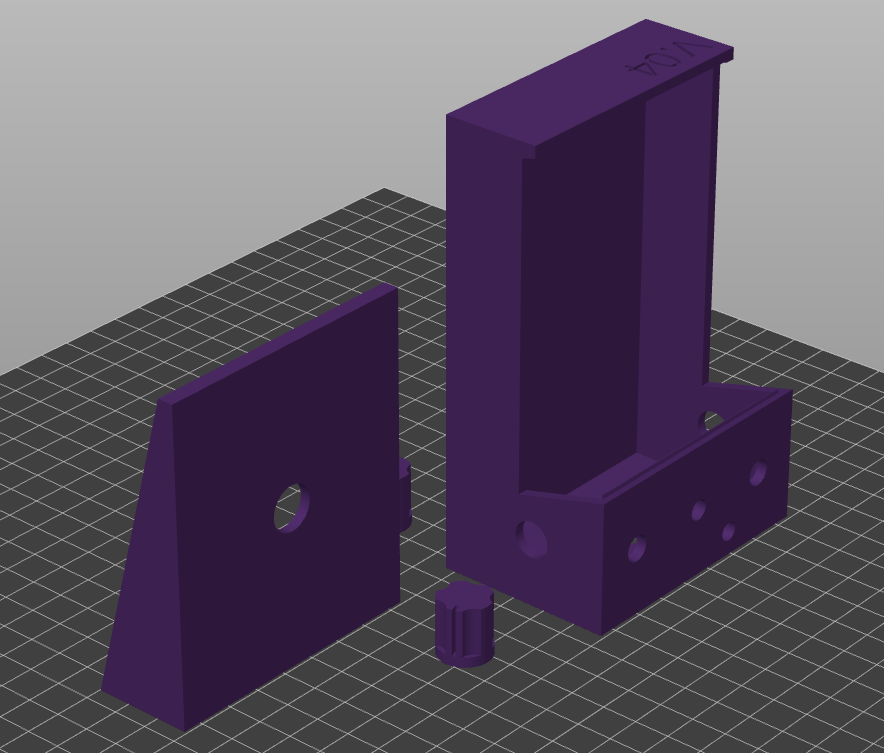

# Universal Stompbox
Any pedal you can think of.

I got this idea while reading [Electronics Projects for Musicians](https://archive.org/details/electronicprojec0000ande).  There's a lot of cool projects in there, but like most guitarists you want something that has a sound that suits you, and I wasn't sure about building these whole projects without being able to try them out a bit.

I thought about breadboarding the circuits to try them out, but it's hard to hook-up an instrument to a bunch of parts on the bench and give it a workout under normal playing conditions.  I like to try different amps, rooms, etc.

Then the idea came to keep the pedal form-factor but make replacing the electronics easier by replacing the circuit board with a breadboard.  Not only does this make changing the pedal completely possible, it makes tweaking the design "in-situ" simple.

I also chose a breadboard size that exactly matches the [Adafruit perma-proto](https://www.adafruit.com/product/571) so it can also be used for permanent designs if so desired.

## Minerals
* 3PDT footswitch ([Amazon](https://www.amazon.com/ESUPPORT-Guitar-Effect-Switch-Bypass/dp/B012CF181K/ref=sr_1_3?crid=3OFZ0CN4QBI8L&keywords=true%2Bbypass%2Bfootswitch&qid=1704382921&sprefix=true%2Bbypass%2Bfootswitch%2Caps%2C122&sr=8-3&th=1)
* Potentiometers (BK10, 24mm x 17mm x 25mm) ([Adafruit](https://www.adafruit.com/product/562))
* Phone jacks ([Amazon](https://www.amazon.com/6-35mm-Female-Microphone-Connector-Adapter/dp/B08MT66VPX/ref=sr_1_4?crid=277SYRYCNU1DJ&keywords=phone+jack+mono&qid=1704383187&sprefix=phone+jack+mono%2Caps%2C145&sr=8-4))
* Power jack ([Amazon](https://www.amazon.com/DIYhz-Socket-Female-Mounting-Connector/dp/B09W9SJ1B6/ref=sr_1_6?crid=1748WOZ1SW6FB&keywords=dc%2Bpower%2Bjack&qid=1704383393&s=industrial&sprefix=dc%2Bpower%2Bjack%2Cindustrial%2C152&sr=1-6&th=1))
* Breadboard ([Adafruit](https://www.adafruit.com/product/4539))
* Toggle switch ([Adafruit](https://www.adafruit.com/product/3221))

## Printing

Parts are designed to print without support if placed in the vertical position like this:

## TODO

* Finish parametricness (some things will respond to parameter changes OK now, but there are exceptions)
* Add some way to more permanently attach the cover
* Fix some weird bugs (like the tiny lip just below the control panel)
* Clean-up the code for modularity, configurability
* Add something to hold breadboard in place
* 

