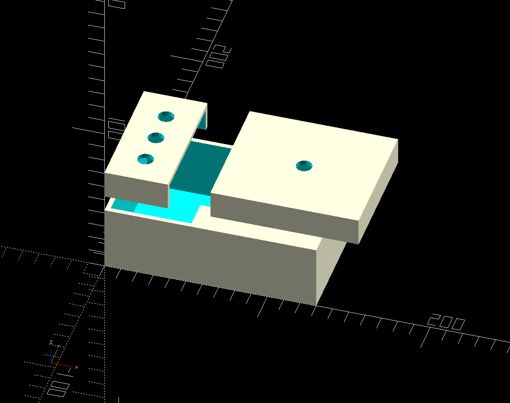

# universal-stompbox
Any pedal you can think of.

I got this idea while reading [Electronics Projects for Musicians](https://archive.org/details/electronicprojec0000ande).  There's a lot of cool projects in there, but like most guitarists you want something that has a sound that suits you, and I wasn't sure about building these whole projects without being able to try them out a bit.

I thought about breadboarding the circuits to try them out, but it's hard to hook-up an instrument to a bunch of parts on the bench and give it a workout under normal playing conditions.  I like to try different amps, rooms, etc.

Then the idea came to keep the pedal form-factor but make replacing the electronics easier by replacing the circuit board with a breadboard.  Not only does this make changing the pedal completely possible, it makes tweaking the design "in-situ" simple.

I also chose a breadboard size that exactly matches the [Adafruit perma-proto]() so it can also be used for permanent designs if so desired.
